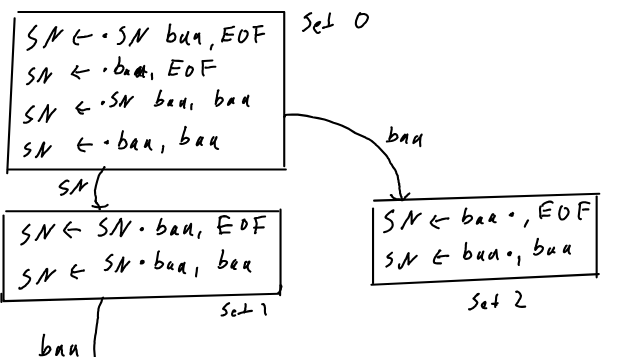

# Parvum Parse: Small Yacc-like Parser Generator



## Compilation

Compile the parser generator with

```
make bin/parvum_parse
```

or the example with

```
make bin/math_parse
```

This can evaluate mathematical expressions.

## Usage

### Specify the grammar

Provide a grammar file `grammar.g` (or any other name) looking like this:

```
%token T_PLUS T_MINUS T_TIMES
%token T_LBRACKET T_RBRACKET
%token T_NUMBER

%start expr

%%

expr: expr T_PLUS term { $$ = (void *)((long)$0 + (long)$2); }
    | expr T_MINUS term { $$ = (void *)((long)$0 - (long)$2); }
    | term { $$ = $0; }

term: term T_TIMES factor { $$ = (void *)((long)$0 * (long)$2); }
    | factor { $$ = $0; }

factor: T_LBRACKET expr T_RBRACKET { $$ = $1; }
      | T_NUMBER { $$ = $0; }

%%

// note that you can put any C code here and it will be put to the end
```

Note that unlike Yacc my version supports only returning `void *` pointers at
any level which makes writing reduction operations look less nice but since
any numeric type will fit into a `void *` pointer you can cast it to anything
you like without loss of data which means that you can also do all the computations
you can do in Yacc.

### Generate C and header file

Then use the `parvum_parse` binary to generate a C file and a header from it:

```
parvum_parse grammar.g
```

This will generate `grammar.gg.c` and `grammar.gg.h` which can then be used
with Lex/Flex and your main C code just as with Yacc.

### Write Lex/Flex file to generate tokens

Example Flex file scanning all the tokens specified in `grammar.g`:

```lex
%option noyywrap

%{
// need to include header generated by parvum_parse to use the token value
// definitions from the grammar (will be an enum in the generated header)
#include "grammar_math.gg.h"
%}


%%
[+] { ppval_in = NULL; return T_PLUS; }

[-] { ppval_in = NULL; return T_MINUS; }

[*] { ppval_in = NULL; return T_TIMES; }

[(] { ppval_in = NULL; return T_LBRACKET; }

[)] { ppval_in = NULL; return T_RBRACKET; }

[0-9]+([.][0-9]*)? { ppval_in = (void *)atoi(yytext); return T_NUMBER; }


.      /* ignore any other characters */

%%

/* Error handler. This will get called if none of the rules match. */
void yyerror (char const *s)
{
  fprintf (stderr, "Flex Error: %s\n", s); /* s is the text that wasn't matched */
  exit(1);
}
```

Note that `ppval` should be set to one value or the other for every token.
It will be the value the `parvum_parse` uses for the tokens which it obtains
through `yylex()` calls.

### Write the main C file

Here you need to declare the `void *parse()` function which is inside the C file
generated by `parvum_parse` and then you can just call it:

```c
#include <stdio.h>

#include "grammar_math.gg.h"

void *pparse();

int main()
{
  printf("Result: %ld\n", (long)pparse());
}
```

### Compile

Compile your C file together with the Flex generated C file and the `parvum_parse`
generated C file into one binary which you can then run.

## Implementation

Use an LR(1) bottom up parser.
It was adapted from this implementation in [parsing_from_scratch](https://github.com/ccrownhill/parsing_from_scratch) (another repository of mine).

However, this version did not support outputting C files and headers that could
then be integrated with your other C code the way Yacc/Bison do it.

For the details behind LR(1) algorithm please see the [parsing_from_scratch](https://github.com/ccrownhill/parsing_from_scratch) repository.

The key to convert this into this parser generator is to convert all the tables
to numbers only so that I could store them as raw data in the output C file.

The other challenge was to add reduce operations.
I did this by adding them as attributes for all rules and then using my
iteration function for my grammar hash map to write a switch statement inside
the generated C file that would execute the correct one.
